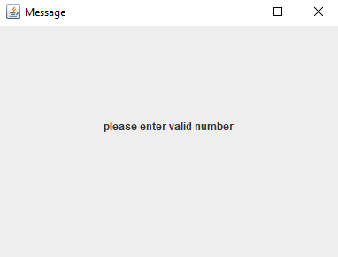

# Manual Test Plan
## 1.Prerequisite and Tools
A Java running environment is requested to run the application.

JDK 14.0.2 and later version is secure for running.
The Application is built with Eclipse SDE Version 2020-12

To install java at https://www.java.com/

## 2. Tests Plan

### TC1. To start the game:
The apperance of Insert Player Panel GUI should be:

With 3 players and none AI players

 

With 3 players and 2 AI players

With invalid player insert window will pop out if too big or too small number or not a number

### TC2. Start the game with 3 players and 2 AI players:

Players queue: "Player 1 - 5" with default clockwised order

The apperance of GUI with 5 players and started game should be:

When you play a valid card and switch to next Player

And then close the window to continue:

### TC3. A Skip Card is played:

The current player should be:

and after skip played, player1 is skipped

### TC4. A reverse Card is played:

Before reversed

After reversed

### TC5. A Wild Card is played:
Poping out window should appear for player to choose the color or number as wild card is played:

Then choose to continue:

### TC6. An invalid Card is played:
ErrorMessage window should appear with message of "invalid card is played, receiving penalty":

Finishing penalty and draw one Card

### TC7 An add4 Card played:

### TC8 Then an add2 Card played:

### TC9. GameOver:

Game Over Message should pop out.

Player 1 is the winner

----------